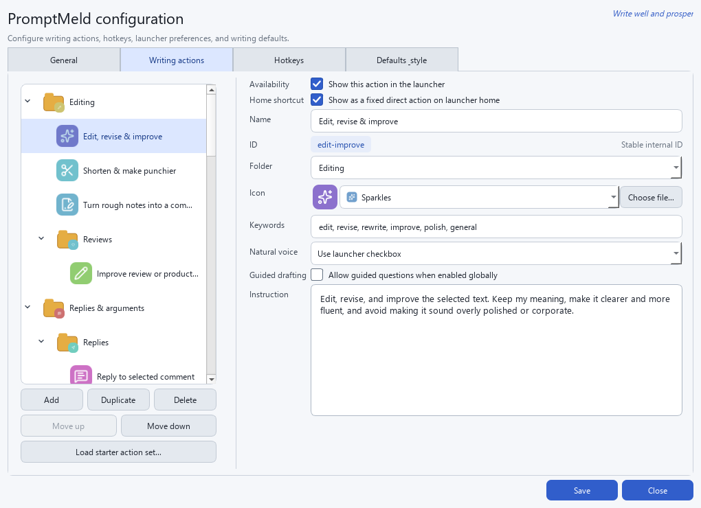
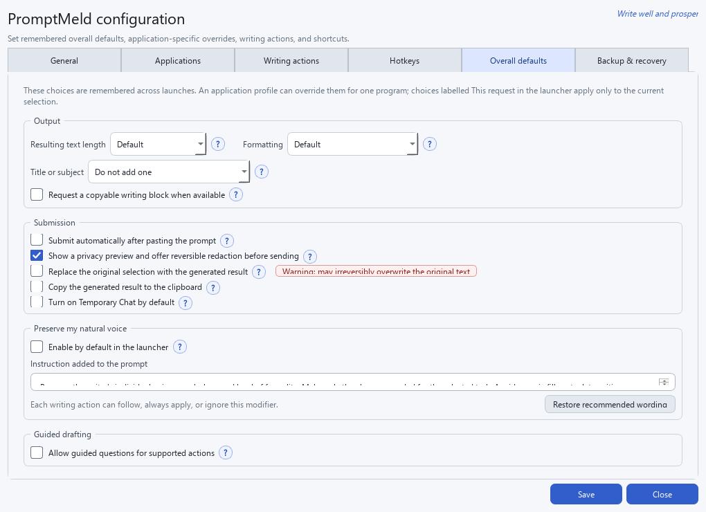
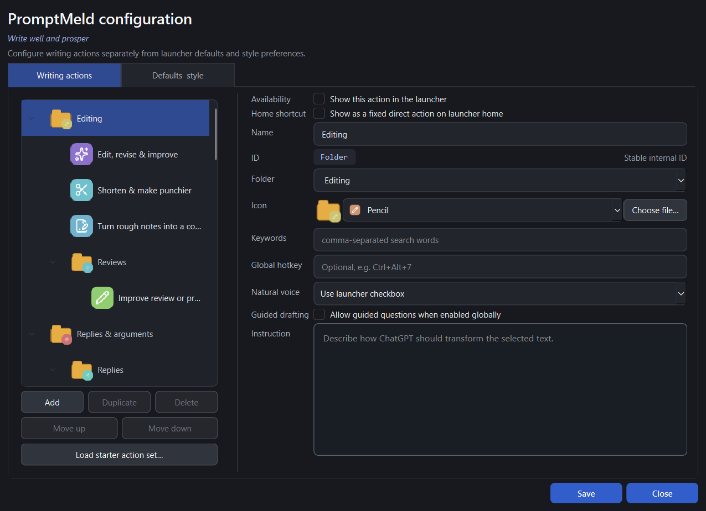

Exit code: 0
Wall time: 0.4 seconds
Output:
# PromptMeld

*Write well and prosper.*

PromptMeld is a Windows tray application for transforming selected text with ChatGPT. Select text in almost any application, invoke a writing action from a keyboard shortcut or Logitech Actions Ring, and the launcher prepares a focused prompt for a fresh chat in a dedicated ChatGPT Project.

The project is an early V1. It deliberately uses Windows accessibility controls rather than fixed screen coordinates. When ChatGPT does not expose the required project controls, the launcher opens ChatGPT and copies the completed prompt instead of typing into an unknown location.

## Features

- Searchable PySide6 popup with keyboard and mouse navigation.
- Configurable folders and nested subfolders, with global search across them.
- Fixed direct actions and an optional, usage-driven most-used section on the
  launcher home screen.
- Frequently and recently used actions ranked first.
- One-off custom instructions.
- A remembered **Preserve my natural voice** modifier with per-action
  overrides.
- A remembered **Submit automatically** option, off by default, so a prompt
  can be left unsent while you choose ChatGPT's model or reasoning level.
- Optional guided drafting for supported actions, with concise questions only
  when essential context is missing.
- Configurable primary writing language, defaulting to **English (UK)**.
- A visual action manager for adding, editing, duplicating, reordering, enabling, and deleting actions.
- Configurable action icons from a bundled Lucide catalogue, emoji, or local image files.
- Configurable badged folder icons with a visually distinct folder style.
- Direct global hotkeys for common actions.
- Native Windows selected-text capture.
- Resident tray application with editable JSON configuration.
- Safe ChatGPT desktop automation with cursor-free UIA activation where
  supported and clipboard fallback.
- Low-overhead idle mode: the popup, icon renderer, settings editor, COM, and
  UI Automation libraries are loaded only when needed. The automation helper
  stays warm briefly for faster consecutive actions, then exits automatically.
- Logi Options+ Actions Ring integration without a custom plugin.
- No API key, telemetry, or selected-text logging.








## Requirements

- Windows 10 or 11.
- Python 3.12 x64 for development.
- The new ChatGPT desktop app, signed in.
- Logi Options+ and an Actions Ring-capable MX device for mouse integration.

Python 3.12 is required for the development environment. Packaged releases do not require Python.

## Setup

1. Install Python 3.12 from [python.org](https://www.python.org/downloads/) and enable the Python launcher during installation.
2. In PowerShell, run:

   ```powershell
   Set-ExecutionPolicy -Scope Process Bypass
   .\setup.ps1
   .\run.ps1
   ```

3. PromptMeld selects or, when necessary, creates a ChatGPT Project named for
   the action's configured folder, such as `PromptMeld - Editing`. Nested
   folders become names such as `PromptMeld - Correspondence - Email`.
   Root-level actions and custom instructions use `PromptMeld`.
4. Optionally add this project instruction in ChatGPT:

   > Treat every chat as an independent writing request. Use only the text supplied in the current chat unless explicitly instructed otherwise.

5. Follow [the Actions Ring setup guide](docs/LOGITECH_ACTIONS_RING.md).

The first run creates editable files in:

```text
%LOCALAPPDATA%\PromptMeld
├── actions.json
├── icons\
├── settings.json
├── usage.json
└── promptmeld.log
```

Use **Manage writing actions…** in the tray menu for normal customization. The
configuration folder and manual reload commands remain available for advanced
editing and troubleshooting.

When upgrading from the original untouched eight-action starter file,
PromptMeld automatically creates `actions.legacy-v1-backup.json` and installs the
current grouped starter set. Existing customised configurations receive the six
new correspondence actions through an additive, one-time migration. Before
that addition the launcher creates
`actions.pre-correspondence-v2-backup.json`; existing actions and edits are
preserved. Actions deleted after migration are not added again.

When upgrading from Writing Launcher, PromptMeld copies the existing
`%LOCALAPPDATA%\WritingLauncher` directory to
`%LOCALAPPDATA%\PromptMeld` on first run. The original directory is retained as
a backup. Existing settings are preserved, except older default project names
(`Writing Launcher`, `WritingLauncher`, and `WritingAssistant`) are migrated to
`PromptMeld`. New installations use `PromptMeld` as the base project name.

## Default shortcuts

| Shortcut | Action |
|---|---|
| `Ctrl+Alt+Space` | Capture selected text and open the launcher |
| `Ctrl+Alt+1` | Edit, revise, and improve |
| `Ctrl+Alt+2` | Shorten and make punchier |
| `Ctrl+Alt+3` | Expand and strengthen argument |
| `Ctrl+Alt+4` | Reply to selected comment |
| `Ctrl+Alt+5` | Sarcastic reply |
| `Ctrl+Alt+6` | Polite but firm reply |

If a shortcut is already registered by another application, PromptMeld reports the conflict from the notification area. Change the relevant `hotkey` in `actions.json` or `popup_hotkey` in `settings.json`.

## How submission works

PromptMeld:

1. Remembers the source window.
2. Clears the text clipboard and sends `Ctrl+C`.
3. Builds a prompt from the selected action and text.
4. Opens or focuses the new ChatGPT desktop app.
5. Selects **ChatGPT** in the global mode switch, starts a top-level new chat,
   and selects **Chat** rather than **Work**.
6. Looks for the exact folder-specific Project (`PromptMeld - Editing`, for
   example), using `PromptMeld` as the configurable base name.
   Empty projects are found by activating the Projects section's **Show more**
   control; the launcher does not assume that a project missing from the
   shortened sidebar is absent.
7. Starts a fresh chat through that existing project's exact **New chat in**
   or **Start new chat in** action. It creates the Project only after the
   expanded exact-name lookup finds no match.
8. Verifies the active project indicator and message composer through Windows
   UI Automation. It does not scroll the sidebar or use fixed coordinates.
9. Pastes only after all controls have been verified. With **Submit
   automatically** enabled it also presses Enter. With the default setting off,
   it leaves the prompt in the composer so you can choose the model or
   reasoning level and submit it yourself.
10. Restores the captured source text to the clipboard after a successful paste.

UI Automation runs in a companion process stored internally at
`_internal\PromptMeldAutomation.exe`. It starts on the first submission, is
reused for consecutive submissions, and exits after 45 seconds without a new
request. This avoids repeated Python and automation-library startup while still
returning to the lower-memory idle state. Prompt data is passed directly to the
companion process through a local pipe and is not written to disk. It is an
implementation component and should not be launched manually.

Buttons are activated through UI Automation's Invoke pattern where ChatGPT
exposes it, so normal operation does not move the mouse pointer. A physical
click is retained only as a compatibility fallback for controls without that
accessibility pattern. The automation also uses an already-visible project's
**New chat in** action directly, avoiding unnecessary navigation. Stage timings
are written to `promptmeld.log` without selected text or prompt contents.

The current ChatGPT Electron app may expose only its outer window frame on some installations. In that case the prompt is copied to the clipboard and ChatGPT is focused. Open the configured PromptMeld Project, start a new Chat, and paste. This fallback is intentional and prevents text from being sent to the wrong UI element.

OpenAI documents the desktop app's ChatGPT/Codex mode switch, the separate
Chat/Work choices, and fresh chats in project context:
[ChatGPT Work and Codex](https://help.openai.com/en/articles/20001275),
[new ChatGPT desktop app](https://help.openai.com/en/articles/20001276/), and
[Projects in ChatGPT](https://help.openai.com/en/articles/10169521-projects-in-chatgpt).

## Customizing actions

Choose **Manage writing actions…** from the tray menu. The configuration
window separates the compact, non-scrolling action editor from global options
using **Writing actions** and **Defaults & style** tabs. Closed dropdowns ignore
mouse-wheel gestures to prevent unintended changes.

The action instruction editor uses high-contrast white text in dark mode.
Editing shows an inline **Unsaved changes** status; choosing **Save** applies the
configuration immediately and changes that status to **Changes saved** without
closing the window or showing a tray notification. Use **Close** when finished.
The tray notification remains available for the separate manual
**Reload configuration** command.

The action manager lets you:

- Add, duplicate, delete, enable, and reorder actions.
- Browse actions in the same expandable folder tree used by the launcher.
- Edit the action name, folder, search keywords, ChatGPT instruction, and
  optional global hotkey.
- Choose whether each action follows, always applies, or ignores the
  **Preserve my natural voice** launcher checkbox.
- Mark actions that may use the optional **Guided drafting** workflow.
- Pin selected actions directly to launcher home.
- Choose how many genuinely used actions appear in the automatic
  **Most used** section, from Off to 10.
- Create subfolders by separating folder names with `/`, for example
  `Replies & arguments/Analysis`.
- Choose from the bundled open-source Lucide icons with a live preview.
- Type an emoji or symbol as an icon.
- Import a PNG, SVG, ICO, JPG, BMP, or WebP icon. Imported files are copied to
  `%LOCALAPPDATA%\PromptMeld\icons` so moving the original will not break
  the action.
- Load the shipped starter action set without writing over the current
  configuration until **Save** is chosen.

Select a folder in the left-hand tree to configure its icon. The selected icon
is displayed as a badge on a gold folder silhouette, keeping folders visually
different from action tiles. Selecting a folder and choosing **Add** creates the
new action inside that folder.

The manager validates required fields, supported hotkey syntax, and duplicate
hotkeys before saving. Changes are reloaded immediately.

The starter set contains 26 actions grouped under:

- **Editing**, including a nested **Reviews** folder.
- **Replies & arguments**, with nested **Replies** and **Analysis** folders.
- **Tone & polish**.
- **Technical help**.
- **Correspondence**, with nested **Email** and **Customer & marketplace**
  folders.

The correspondence folders add **Reply to email**, **Formal email reply**,
**Follow up or polite reminder**, **Reply to customer message**, **Reply to
eBay or marketplace message**, and **Respond to complaint or problem**. Their
instructions explicitly avoid inventing facts, policies, dates, refunds, or
commitments.

Search always covers every folder. Within a folder, frequently and recently
used actions remain ranked first. The starter set pins **Edit, revise &
improve**, **Shorten & make punchier**, and **Reply to selected comment** to the
home screen. Most-used entries only appear after they have actually been used
and never duplicate pinned entries.

The **Submit automatically** launcher checkbox is off by default and its state
is remembered. When off, direct actions and normal launcher actions still open
a fresh chat in the action's folder-specific Project and paste the complete
prompt, but they do not press Enter. This leaves ChatGPT focused so you can
choose its current model or reasoning level first. Turn the checkbox on for the
original one-step workflow, or configure it as enabled by default under
**Defaults & style**.

PromptMeld deliberately does not automate model-picker entries. Their
names, availability, and layout can change and can differ by account. OpenAI
also documents that a chosen thinking-time preference can be reused for future
queries until changed, so manual selection may not be needed every time:
[GPT-5.5 in ChatGPT](https://help.openai.com/en/articles/11909943-gpt-5-3-and-gpt-55-in-chatgpt)
and [ChatGPT release notes](https://help.openai.com/en/articles/6825453-chatgpt-release-notes).

The **Preserve my natural voice** checkbox applies one centrally configured
style modifier to the current request. Its state is remembered and is also used
by direct hotkey and Actions Ring commands that skip the popup. Configure its
default state and wording under **Defaults & style**. The natural-voice section
explains what is added to prompts, provides a multi-line editor, and can restore
the recommended wording. Each action can follow the launcher checkbox, always
apply the modifier, or never apply it.
The recommended wording also tells ChatGPT not to use em dashes, preferring a
standard dash (`-`) or other suitable punctuation. Preserving personal phrasing
may make a result less likely to be flagged by AI-detection tools, but those
tools are unreliable and avoidance is far from guaranteed.

The primary writing language defaults to **English (UK)**, so ordinary actions
request British spelling, vocabulary, punctuation, and conventions. An action
that explicitly requests translation or another language takes precedence.
**English (US)** and **Preserve source language** are also available, and a
custom language can be entered in the configuration window.

**Guided drafting** is off by default. Enable it under **Defaults & style** to
allow actions individually marked as supported to ask up to three concise
questions when essential context is missing. Choices are offered where useful,
and all questions and answers take place in the ChatGPT chat. When the selected
text already provides enough context, ChatGPT drafts immediately. The six
correspondence actions support this mode by default; quick editing actions
remain immediate unless you opt them in. This follows OpenAI's guidance that
project instructions can request clarifying questions and that prompting can
work iteratively through follow-ups: [Projects in
ChatGPT](https://help.openai.com/en/articles/10169521-using-connectors-in-chatgpt)
and [prompting
guidance](https://help.openai.com/en/articles/4936848-how-do-i-create-a-good-prompt-for-an-ai-model-like-gpt4).

Translation-specific actions are not included yet. The configurable primary
language and per-action instructions leave room for them in a later release.

The **Fact-check / sanity-check** action asks ChatGPT to use web search when
verification needs current or reliable sources. Whether search is available
depends on the signed-in ChatGPT account and desktop app.

For manual or scripted editing, each entry in `actions.json` has this shape:

```json
{
  "id": "shorten",
  "name": "Shorten",
  "keywords": ["concise", "brief", "trim"],
  "instruction": "Shorten the text while preserving its meaning and essential details.",
  "hotkey": "Ctrl+Alt+2",
  "enabled": true,
  "icon": "lucide:scissors",
  "folder": "Editing",
  "show_on_home": true,
  "natural_voice": "inherit",
  "guided_drafting": false
}
```

Action IDs must be unique. Set `hotkey` to `null` for actions available only
through search. An icon can be a `lucide:name` value from the built-in
catalogue, an emoji or short symbol, or a path relative to the application data
folder. Leave `folder` empty for a root-level action or use `/` for nested
folders. Choose **Reload configuration** from the tray menu after manual edits.
Valid `natural_voice` values are `inherit`, `always`, and `never`.
Set `guided_drafting` to `true` only for actions that may benefit from asking
for missing context.

Home-screen and folder presentation settings are stored in `settings.json`:

```json
{
  "project_name": "PromptMeld",
  "home_most_used_count": 3,
  "auto_submit_enabled": false,
  "natural_voice_enabled": false,
  "natural_voice_instruction": "Preserve the writer's individual voice...",
  "primary_language": "English (UK)",
  "guided_drafting_enabled": false,
  "folder_icons": {
    "Editing": "lucide:pencil",
    "Editing/Reviews": "lucide:heart"
  }
}
```

## Development

Run the test suite:

```powershell
.\.venv\Scripts\python.exe -m pytest
```

Run the dependency licence audit directly:

```powershell
.\.venv\Scripts\python.exe .\tools\check_licenses.py
```

Build a one-folder portable release:

```powershell
.\build.ps1
```

The output is written to `dist\PromptMeld`. `PromptMeld.exe` is the
only executable users should launch. Keep the `_internal` directory beside it;
that directory contains the automation companion and other required runtime
files. One-folder packaging is used because it starts faster and is easier for
antivirus products to inspect than a self-extracting one-file executable.
Each build first audits every declared and transitive package against
`dependency-license-policy.json`. After packaging, it also checks the actual
Qt DLLs and plugins, copies the applicable licence texts into `LICENSES`, and
refuses to complete if an unreviewed dependency or binary appears.

## Privacy

Selected text and generated prompts are never written to logs. The app stores only action usage counts and timestamps. See [PRIVACY.md](PRIVACY.md) for details.

## License

PromptMeld's original source code is MIT licensed. Runtime components retain
their own licences. PySide6 and the bundled Qt libraries are used under
LGPL-3.0-only, with separately replaceable DLLs and the required notices;
permissively licensed components include Python, pywin32, pywinauto, comtypes,
six, OpenSSL, and Lucide. The unused GPL-only Qt Virtual Keyboard component is
explicitly removed and prohibited by the release audit. See [LICENSE](LICENSE),
[THIRD_PARTY_NOTICES.md](THIRD_PARTY_NOTICES.md), and [LICENSES](LICENSES).

