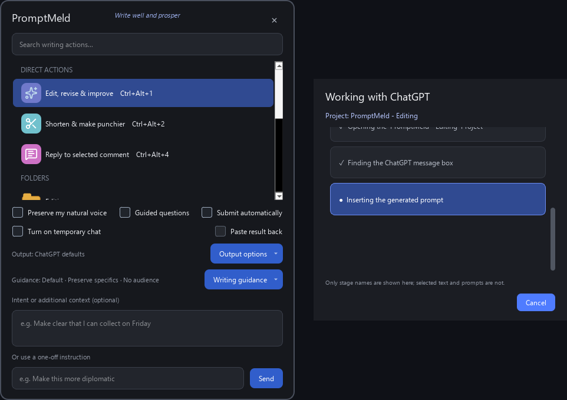

<p align="center">
  
</p>

<h1 align="center">PromptMeld</h1>

<p align="center"><em>Write well and prosper.</em></p>

PromptMeld is a Windows companion for turning selected text into focused
ChatGPT writing requests. Highlight text in almost any application, choose a
writing action, and PromptMeld opens a fresh chat in an organised ChatGPT
Project—or, optionally, a Temporary Chat outside Projects—and inserts the
completed prompt.

It is designed to remove repetitive copying, prompt-writing, and navigation
while keeping you in control of what reaches ChatGPT and when it is submitted.

> [!IMPORTANT]
> PromptMeld is an early first release with limited real-world testing. Bugs,
> compatibility issues, and changes to the ChatGPT desktop interface may affect
> it. Please report problems through
> [GitHub Issues](https://github.com/an1uk/promptmeld-windows/issues).

## What it does

PromptMeld melds your selected text with a reusable writing prompt, then opens
ChatGPT and inserts the combined request into a fresh chat.

- Includes 26 starter actions for editing, replies, tone, technical help, and
  correspondence.
- Searches actions across configurable folders and ranks frequently used
  actions first.
- Supports custom instructions, action-specific hotkeys, and imported icons.
- Offers optional natural-voice, guided-drafting, length, formatting, and
  copyable-writing-block controls.
- Provides per-request guidance for editing strength, factual preservation,
  recipient or audience, and the writer's intent or additional context.
- Can use ChatGPT Temporary Chat instead of the action's configured Project.
- Leaves prompts unsubmitted by default, giving you time to choose the model or
  reasoning level in ChatGPT.
- Can optionally replace a selected editable field with the generated response
  after automatic submission, or copy the generated response to the clipboard.
- Uses Windows accessibility controls instead of relying on fixed screen
  coordinates.
- Requires no OpenAI API key and contains no telemetry or advertising.
- Can optionally be launched from a compatible Logitech Options+ Actions Ring;
  Logitech hardware and software are not required.



## Install

PromptMeld requires Windows 10 or 11 and the current ChatGPT desktop app,
signed in to your account.

> [!NOTE]
> PromptMeld does not require a paid subscription or an OpenAI API key.
> However, many features work best with a paid ChatGPT subscription. Available
> models, reasoning controls, Projects, writing blocks, and related features
> depend on your ChatGPT account and plan, so some PromptMeld options may be
> unavailable or have a more limited effect on free accounts.

### Current compatibility

PromptMeld currently works only with the new ChatGPT desktop app for Windows.
It does not currently work with:

- The Classic ChatGPT desktop experience.
- ChatGPT in a web browser.

Support for either may be investigated if PromptMeld gains sufficient traction
and users request it. Please add your interest and use case through
[GitHub Issues](https://github.com/an1uk/promptmeld-windows/issues).

1. Download the latest `PromptMeld-Setup-v<version>.exe` from the
   [latest release](https://github.com/an1uk/promptmeld-windows/releases/latest).
2. Run the installer.
3. Launch **PromptMeld** from the Start menu.

The installer includes everything needed to run PromptMeld. Python and Inno
Setup are only required for development.

The installer is not yet code-signed, so Microsoft Defender SmartScreen may
describe it as an unrecognised app. Only install a copy downloaded from this
repository.

### Updates

Installed copies check the latest stable GitHub release at most once per day.
When a newer version is available, PromptMeld shows one Windows notification
and keeps an **Update available** entry in its notification-area menu. Choose
that entry, or use **Check now** in **Configuration > General > Updates**, to
download the installer.

PromptMeld verifies the installer filename, size, download location, and the
SHA-256 digest published by GitHub before it can be opened. The normal visible
installer then performs the update and offers to relaunch PromptMeld. Automatic
checks can be disabled in Configuration; manual checks remain available.

## Use

1. Select text in another application.
2. Press `Ctrl+Alt+Space`.
3. Choose a writing action.

The keyboard shortcut is the primary way to open the launcher because it
preserves focus and the current selection in the source application.
Double-click the PromptMeld notification-area icon to open **Configuration…**.
The tray menu shows the currently configured launcher shortcut as a reminder;
selecting that entry displays brief usage guidance rather than attempting to
capture text after the tray has taken focus.

PromptMeld builds the instruction, opens ChatGPT, selects or creates the
appropriate PromptMeld Project, starts a fresh chat, and inserts the prompt.
Automatic submission is off by default, so you can review the prompt and
choose ChatGPT settings before sending it.

### Generated-text output and replacement

The **Submission** section of Configuration can optionally copy generated text
to the clipboard or replace the selected text in an editable field after
ChatGPT responds. The **Applications** tab can override this for Word, Outlook,
browsers, text editors, messaging apps, or any named executable. For example,
Word can replace automatically while Chrome copies results only.

Before replacement, PromptMeld returns to the original window and verifies
that the same source text is still selected. If focus, selection, editability,
or paste access changed, the original is left alone and the generated result is
copied instead. PromptMeld preserves the original in memory and provides
**Undo last replacement** and **Copy preserved original** in the tray menu.
The preserved text is never written to disk and is forgotten when PromptMeld
closes or another original replaces it.

The automation progress window can be cancelled with its button or Escape.
It keeps actionable failures visible, and Configuration provides
privacy-filtered diagnostics and direct access to the local log folder.

Use **Intent or additional context** in the launcher to supply a desired
outcome, constraint, or point that is not already present in the selected
text. PromptMeld keeps these notes separate from the source text in the
generated prompt. They work with both configured writing actions and one-off
instructions.

The **Writing guidance** menu provides per-request controls for:

- **Editing strength:** Default, Proofread, Improve, or Rewrite.
- **Preserve facts and specifics:** protects names, dates, amounts, quotations,
  URLs, product details, policies, commitments, and similar details.
- **Recipient or audience:** adapts wording for personal, workplace, customer,
  support, public, or general-reader contexts.

These choices reset for each newly captured selection. Factual protection
starts On; editing strength and audience start at their neutral defaults.

Turn on **Temporary Chat** in the launcher when you do not want the action to
use its configured Project. On first use, ChatGPT may show an explanation with
a **Continue** button. PromptMeld pauses so you can read and respond to that
dialog yourself; it never accepts the explanation for you.

If the required ChatGPT controls cannot be verified safely, PromptMeld focuses
ChatGPT and leaves the completed prompt on the clipboard for you to paste
manually.

### Default shortcuts

| Shortcut | Action |
|---|---|
| `Ctrl+Alt+Space` | Capture selected text and open the launcher |
| `Ctrl+Alt+1` | Edit, revise, and improve |
| `Ctrl+Alt+2` | Shorten and make punchier |
| `Ctrl+Alt+3` | Expand and strengthen argument |
| `Ctrl+Alt+4` | Reply to selected comment |
| `Ctrl+Alt+5` | Sarcastic reply |
| `Ctrl+Alt+6` | Polite but firm reply |

Shortcuts can be changed in the **Hotkeys** tab of **Configuration…** by
clicking a field and pressing the desired key combination. PromptMeld flags
duplicates and asks Windows whether each shortcut is already registered by
another application.

## Privacy

PromptMeld runs locally and does not create a stored copy of selected text.
Text is captured only when you invoke an action: it enters through the Windows
clipboard and is held briefly in memory while the prompt is assembled.
PromptMeld inserts the completed prompt through verified local accessibility
controls, using a targeted clipboard paste only when direct insertion is
unavailable.

Selected text, additional information, one-off custom instructions, and
completed prompts are not written to PromptMeld's settings, usage data, or
logs. After successful insertion, the original selected text is restored to
the clipboard. If safe automation is not possible, the completed prompt
remains there for manual pasting.

Clipboard-history tools, including Windows Clipboard History and third-party
clipboard managers, may independently retain copied text. Once text is inserted
into ChatGPT, its handling is governed by your ChatGPT account settings and
OpenAI's policies.

Read the full [PromptMeld privacy explanation](PRIVACY.md), including exactly
what is stored locally and how to remove it.

## Configure

Choose **Configuration…** from the notification-area menu to add,
organise, edit, duplicate, disable, or delete actions. The same window controls
folder icons, natural-voice wording, primary language, guided drafting, and
automatic submission, along with output length, formatting, and writing-block
preferences. Application-specific result handling and diagnostics have their
own **Applications** tab.

PromptMeld keeps its editable configuration under:

```text
%LOCALAPPDATA%\PromptMeld
```

See [Configuration and customisation](docs/CONFIGURATION.md) for the action
manager, JSON formats, data files, and upgrade behaviour.

## Get involved

PromptMeld is an early open-source project, and participation is welcome.
[Report bugs or suggest improvements](https://github.com/an1uk/promptmeld-windows/issues),
help test new releases, improve the documentation, or submit a pull request.
If you plan a substantial change, opening an issue first is a good way to
discuss the approach.

## Disclaimer

PromptMeld is experimental software supplied **as is**, without any guarantee
that it will be uninterrupted, error-free, compatible with every system, or
suitable for a particular purpose. It depends on Windows, the ChatGPT desktop
app, Windows accessibility controls, and third-party services whose behaviour
and interfaces may change without notice.

PromptMeld may fail to capture, transform, paste, or submit text correctly.
ChatGPT may produce inaccurate, incomplete, inappropriate, or unexpected
content. Always review the completed prompt and resulting text before sending,
publishing, or relying on it. Keep appropriate backups and do not use
PromptMeld or AI-generated output as a substitute for professional advice or
for safety-critical decisions.

To the fullest extent permitted by applicable law, PromptMeld's authors,
contributors, and distributors accept no liability for any loss, damage,
claim, cost, missed or incorrect communication, data loss, business
interruption, account issue, or other consequence arising from the software,
its failure, its use or inability to be used, AI-generated content, or
third-party services. Nothing in this disclaimer excludes or restricts any
liability that cannot lawfully be excluded or restricted.

The formal warranty and liability terms are contained in the
[MIT Licence](LICENSE).

## Documentation

- [Research report: AI Writing — Promise, Resistance and Access](docs/AI_WRITING_PROMISE_RESISTANCE_AND_ACCESS.md)
- [Privacy](PRIVACY.md)
- [Configuration and customisation](docs/CONFIGURATION.md)
- [ChatGPT automation and fallback behaviour](docs/AUTOMATION.md)
- [Optional Logitech Actions Ring setup](docs/LOGITECH_ACTIONS_RING.md)
- [Development, testing, and building](docs/DEVELOPMENT.md)
- [Third-party notices](THIRD_PARTY_NOTICES.md)

## Licence

PromptMeld's original source code is available under the
[MIT Licence](LICENSE). Bundled runtime components retain their own licences;
see [Third-party notices](THIRD_PARTY_NOTICES.md) and the
[collected licence texts](LICENSES).
