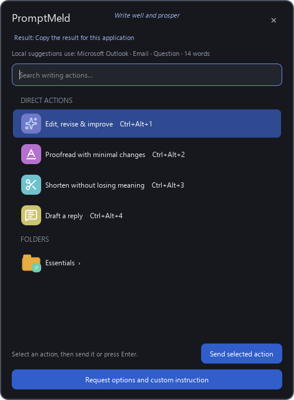

<p align="center">
  
</p>

<h1 align="center">PromptMeld</h1>

<p align="center"><em>Write well and prosper.</em></p>

PromptMeld is a Windows companion for turning selected text into focused
ChatGPT writing requests. Highlight text in almost any application, choose a
writing action, and PromptMeld opens a fresh chat in an organised ChatGPT
Project and pastes the completed prompt.

It is designed to remove repetitive copying, prompt-writing, and navigation
while keeping you in control of what reaches ChatGPT and when it is submitted.

> [!IMPORTANT]
> PromptMeld is an early first release with limited real-world testing. Bugs,
> compatibility issues, and changes to the ChatGPT desktop interface may affect
> it. Please report problems through
> [GitHub Issues](https://github.com/an1uk/promptmeld-windows/issues).

## What it does

PromptMeld melds your selected text with a reusable writing prompt, then opens
ChatGPT and pastes the combined request into a fresh chat.

- Includes 26 starter actions for editing, replies, tone, technical help, and
  correspondence.
- Searches actions across configurable folders and ranks frequently used
  actions first.
- Supports custom instructions, action-specific hotkeys, and imported icons.
- Offers optional natural-voice and guided-drafting controls.
- Leaves prompts unsubmitted by default, giving you time to choose the model or
  reasoning level in ChatGPT.
- Uses Windows accessibility controls instead of relying on fixed screen
  coordinates.
- Requires no OpenAI API key and contains no telemetry or advertising.
- Can optionally be launched from a compatible Logitech Options+ Actions Ring;
  Logitech hardware and software are not required.



## Install

PromptMeld requires Windows 10 or 11 and the current ChatGPT desktop app,
signed in to your account.

### Current compatibility

PromptMeld currently works only with the new ChatGPT desktop app for Windows.
It does not currently work with:

- The Classic ChatGPT desktop experience.
- ChatGPT in a web browser.

Support for either may be investigated if PromptMeld gains sufficient traction
and users request it. Please add your interest and use case through
[GitHub Issues](https://github.com/an1uk/promptmeld-windows/issues).

1. Download the latest `PromptMeld-Setup-v<version>.exe` from the
   [latest release](https://github.com/an1uk/promptmeld-windows/releases/latest).
2. Run the installer.
3. Launch **PromptMeld** from the Start menu.

The installer includes everything needed to run PromptMeld. Python and Inno
Setup are only required for development.

The installer is not yet code-signed, so Microsoft Defender SmartScreen may
describe it as an unrecognised app. Only install a copy downloaded from this
repository.

## Use

1. Select text in another application.
2. Press `Ctrl+Alt+Space`.
3. Choose a writing action.

PromptMeld builds the instruction, opens ChatGPT, selects or creates the
appropriate PromptMeld Project, starts a fresh chat, and pastes the prompt.
Automatic submission is off by default, so you can review the prompt and
choose ChatGPT settings before sending it.

If the required ChatGPT controls cannot be verified safely, PromptMeld focuses
ChatGPT and leaves the completed prompt on the clipboard for you to paste
manually.

### Default shortcuts

| Shortcut | Action |
|---|---|
| `Ctrl+Alt+Space` | Capture selected text and open the launcher |
| `Ctrl+Alt+1` | Edit, revise, and improve |
| `Ctrl+Alt+2` | Shorten and make punchier |
| `Ctrl+Alt+3` | Expand and strengthen argument |
| `Ctrl+Alt+4` | Reply to selected comment |
| `Ctrl+Alt+5` | Sarcastic reply |
| `Ctrl+Alt+6` | Polite but firm reply |

Shortcuts can be changed in **Configuration…**. PromptMeld reports a
notification-area warning if another application already uses one.

## Privacy

PromptMeld runs locally and does not create a stored copy of selected text.
Text is captured only when you invoke an action: it enters through the Windows
clipboard, is held briefly in memory while the prompt is assembled, and is
placed on the clipboard so it can be pasted into ChatGPT.

Selected text, one-off custom instructions, and completed prompts are not
written to PromptMeld's settings, usage data, or logs. After a successful
paste, the original selected text is restored to the clipboard. If safe
automation is not possible, the completed prompt remains there for manual
pasting.

Clipboard-history tools, including Windows Clipboard History and third-party
clipboard managers, may independently retain copied text. Once text is pasted
into ChatGPT, its handling is governed by your ChatGPT account settings and
OpenAI's policies.

Read the full [PromptMeld privacy explanation](PRIVACY.md), including exactly
what is stored locally and how to remove it.

## Configure

Choose **Configuration…** from the notification-area menu to add,
organise, edit, duplicate, disable, or delete actions. The same window controls
folder icons, natural-voice wording, primary language, guided drafting, and
automatic submission.

PromptMeld keeps its editable configuration under:

```text
%LOCALAPPDATA%\PromptMeld
```

See [Configuration and customisation](docs/CONFIGURATION.md) for the action
manager, JSON formats, data files, and upgrade behaviour.

## Get involved

PromptMeld is an early open-source project, and participation is welcome.
[Report bugs or suggest improvements](https://github.com/an1uk/promptmeld-windows/issues),
help test new releases, improve the documentation, or submit a pull request.
If you plan a substantial change, opening an issue first is a good way to
discuss the approach.

## Documentation

- [Privacy](PRIVACY.md)
- [Configuration and customisation](docs/CONFIGURATION.md)
- [ChatGPT automation and fallback behaviour](docs/AUTOMATION.md)
- [Optional Logitech Actions Ring setup](docs/LOGITECH_ACTIONS_RING.md)
- [Development, testing, and building](docs/DEVELOPMENT.md)
- [Third-party notices](THIRD_PARTY_NOTICES.md)

## Licence

PromptMeld's original source code is available under the
[MIT Licence](LICENSE). Bundled runtime components retain their own licences;
see [Third-party notices](THIRD_PARTY_NOTICES.md) and the
[collected licence texts](LICENSES).
