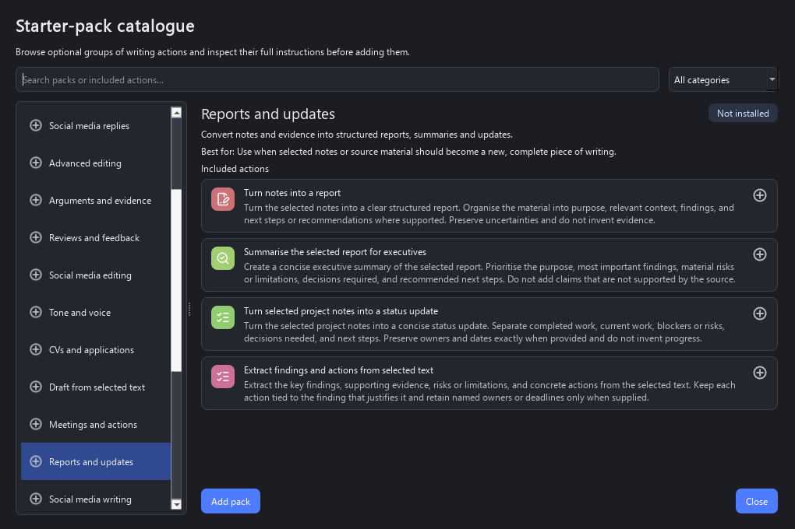

# Configuration and customisation

PromptMeld is designed to be configured through **Configuration…** in
the notification-area menu. Direct JSON editing remains available for advanced
use and troubleshooting.

The **General** tab also controls daily GitHub update checks. Automatic checks
are enabled by default and can be disabled without removing the manual
**Check now** option. When an update is available, the same section provides
the release notes and verified installer actions.

## Action manager

The action manager lets you:

- Add or duplicate actions through a short guided wizard, then delete, enable,
  and reorder them in the full editor.
- Select a folder and delete it, its nested folders, and all contained actions
  after reviewing a count-bearing confirmation.
- Import and export portable, readable JSON action packs.
- Browse twenty-one optional four-action starter packs, inspect their actions,
  and add, update, restore, or remove them without affecting unrelated actions.
- Organise actions in folders and nested folders.
- Edit action names, search keywords, and ChatGPT instructions.
- Pin actions to the launcher home screen.
- Choose whether an action follows, always applies, or ignores the
  **Preserve my natural voice** setting.
- Allow suitable actions to use optional guided drafting.
- Set a default recipient or audience for an action while retaining a
  per-request launcher override.
- Describe the action's purpose and choose how its result should be handled.
  Analysis, extraction, and idea-development purposes recommend a safe review
  that cannot replace the original selection unless the action is explicitly
  configured otherwise.
- Choose bundled Lucide icons, type an emoji or symbol, or import a local image.
- Configure badged folder icons.
- Control how many genuinely used actions appear in **Most used**.

Changes take effect immediately after **Save**. Required fields and action IDs
are validated before saving.

The creation and duplication wizard covers the visible name and instruction
first, followed by folder, search keywords, icon, behaviour, and an optional
shortcut. The shortcut can be tested against existing PromptMeld shortcuts and
Windows before the action is created. The full editor remains available for
later adjustments. A final test page combines the draft action with editable
sample text and previews the complete request locally; it does not contact
ChatGPT.

Action-pack imports preserve action order, folders, icons, behaviour, and
non-conflicting shortcuts. PromptMeld adapts duplicate internal IDs and clears
shortcuts that would clash with an enabled action already in the library.
Exports can contain one selected action or the complete library. The JSON is
UTF-8 text intended to be readable and version-controllable. It references but
does not embed custom image files.

An exported pack has this top-level structure:

```json
{
  "format": "promptmeld-action-pack",
  "format_version": 1,
  "name": "My editing tools",
  "description": "Actions shared by the writing team.",
  "actions": [
    {
      "id": "make-clear",
      "name": "Make clear",
      "keywords": ["clarity", "edit"],
      "instruction": "Improve clarity without changing the meaning.",
      "hotkey": null,
      "enabled": true,
      "icon": "lucide:sparkles",
      "folder": "Edit & revise/Clarity",
      "show_on_home": false,
      "natural_voice": "inherit",
      "guided_drafting": false,
      "purpose": "transform",
      "result_handling": "purpose_default"
    }
  ]
}
```

Choose **New subfolder** to select a parent and name a nested level, or use `/`
in a folder path directly, for example `Reply/General replies`. The built-in
packs use shared intent-led roots such as
**Reply**, **Edit & revise**, **Draft & create**, **Summarise & understand**,
**Review & develop**, **Explain & learn**, and **Plan & decide**, rather than
creating a separate top-level folder for every pack. Search covers every folder,
while frequently and recently used actions rank first within the current scope.
When the launcher has a captured selection, it also shows a **Suggested**
section and ranks search and folder results using the source application,
selection-length band, and locally detected text type. Pinned **Direct actions**
keep their fixed position. Pause over a suggested action to see the ranking
reasons.

## General settings

The **General** tab controls:

- Appearance: Auto (the default, following the Windows app colour mode), Light,
  or Dark. Windows High Contrast takes precedence automatically, and disabling
  Windows animations also disables PromptMeld's progress scrolling animation.
- Primary writing language: English (UK), English (US), source language, or a
  custom language.
- The number of most-used actions shown on the launcher home screen.
- Whether PromptMeld starts automatically when you sign in to Windows.
- A reusable first-use setup guide that distinguishes ChatGPT on the web from
  the required Windows desktop app, checks its local Windows registration,
  provides the official download page when missing, and tests the launcher
  shortcut.
- The ChatGPT Project base name and naming strategy:
  - **Writing action or folder** keeps the current organisation, for example
    `PromptMeld - Editing`.
  - **One project for everything** uses the base name alone, normally
    `PromptMeld`.
  - **Application the text came from** appends a friendly source-application
    name, for example `PromptMeld - Microsoft Outlook`.

Application profiles can override the project base name for one executable.
The selected overall naming strategy is then applied to that base. The
one-project strategy deliberately ignores application-specific base overrides,
ensuring every normal request uses the same project. Temporary Chat always
bypasses Projects.

## Hotkeys

The **Hotkeys** tab shows the required launcher shortcut in its own section,
separate from the writing-action shortcuts below it. Click a shortcut field,
then press the actual combination you want to use, or choose **Change** and
then press it. A shortcut must contain one supported key together with Ctrl,
Alt, Shift, or the Windows key. Use **Clear** to remove an action shortcut; the
launcher shortcut is required but can be replaced with **Change**. Actions with
assigned shortcuts are grouped above actions without shortcuts.

PromptMeld flags duplicates immediately. It also asks Windows whether an active
shortcut is already registered by the operating system or another application.
This is a useful clash check, but some applications handle keys without
registering a Windows global hotkey and therefore cannot be detected in
advance.

## Overall defaults

The **Overall defaults** tab controls choices remembered across launches:

- Automatic submission, which is off by default.
- **Privacy preview and redaction**, enabled by default. It checks a prompt
  locally before it is opened in ChatGPT and offers reversible placeholders
  for possible email addresses, phone numbers, account numbers, and names.
  Turning it off skips the preview and sends prompts unchanged.
- Copying generated text to the clipboard after ChatGPT responds. This also
  requires automatic submission.
- Replacing selected text automatically when the source selection was detected
  in an editable control. This also requires automatic submission. PromptMeld
  verifies the preserved selection again immediately before pasting.
- Temporary Chat, which opens a top-level chat instead of using the writing
  action's configured Project. ChatGPT may show a one-time explanation;
  PromptMeld waits while you read and respond to it and does not activate
  **Continue** for you.
- Resulting text length, with qualitative choices from **Extra short** to
  **Extra long**. **Default** adds no length instruction to the prompt.
- Result formatting: use ChatGPT's default behaviour, prevent newly added
  formatting, or request restrained formatting where it improves readability.
- An optional separate title or subject line. Choose a title, an email-style
  subject, or let the writing task determine which label is appropriate. The
  suggestion is placed above the complete main text so it can be copied into a
  separate field such as an Amazon review title.
- A best-effort request for ChatGPT to place the finished result in an editable,
  copyable writing block. Availability depends on the current ChatGPT plan,
  device, workspace settings, model, and rollout.
- The default state and wording of **Preserve my natural voice**.
- Guided drafting, which allows supported actions to ask up to three concise
  questions when essential context is missing.

These settings provide the initial remembered states of the corresponding
launcher checkboxes. Changing **Preserve my natural voice**, **Guided
questions** and **Submit automatically** in the launcher updates that remembered
setting for the next use. The launcher's **Temporary Chat** checkbox is also
remembered. Less frequently changed length, formatting, title or subject, and
writing-block settings are grouped under the launcher's **Remembered output**
menu and are remembered in the same way.

Automatic replacement is opt-in and the generated response may still be wrong
or unsuitable. PromptMeld preserves the original in memory and exposes
**Undo last replacement** and **Copy preserved original** in the tray. If the
source selection changed or replacement cannot be verified, PromptMeld copies
the generated result and leaves the original alone.

## Application-specific defaults

The **Applications** tab gives each source executable an optional profile.
Double-click a row, or select it and choose **Configure selected**, to open its
dedicated configuration page. Common Microsoft Office applications, browsers,
Teams, Notepad and Visual Studio Code are available from the picker; another
executable name can be typed directly.

An application profile can override:

- Recipient or audience, including workplace, customer, support, public and
  general-reader choices.
- Primary language, result length, plain or formatted output, and whether to
  generate a separate title or subject line.
- Editing strength and whether facts and specifics must be preserved.
- Natural voice, guided drafting and copyable writing blocks.
- The base ChatGPT Project name, automatic submission, Temporary Chat, and
  whether to show the privacy preview for that application.
- A response wait of one, three, five, ten, or twenty minutes, or an
  indefinite wait that remains cancellable.
- Whether the generated result replaces the verified source selection, is
  copied with a notification, waits for a **Copy result** or **Apply now**
  choice, or remains in ChatGPT.

Every option can inherit its **Overall defaults** or launcher value, so
a profile only needs to describe what is genuinely different. A replacement
profile still safely falls back to copying when the source does not expose an
editable control.

New configurations include conservative starter profiles. Microsoft Word
waits until completion or cancellation and then replaces a verified editable
selection. Notepad also replaces verified text. Chrome, Edge and Firefox wait
up to ten minutes, notify, and copy the result. Outlook, New Outlook, Teams and
Slack copy the generated result. Outlook and Notepad use plain text, while
Teams and Slack demonstrate short, plain-text wording for a colleague or peer.
These profiles remain fully editable or removable. Existing configurations
receive new starter behaviour only when their earlier application settings are
still untouched; user changes and deletions are preserved.

## Backup, restore, and diagnostics

The **Backup & recovery** tab creates one portable ZIP file containing saved
writing actions, settings, application profiles, hotkeys, and installed custom
icons. Usage history, logs, update state, selected text, prompts, and responses
are not included. Suggested filenames contain the PromptMeld version and a
timestamp. The internal manifest separately records the application version,
creation time, and versioned backup format. If Configuration has unsaved
changes, PromptMeld offers to save and include them or back up the last saved
configuration.

Restore validates the archive format, file paths, size, settings, and actions
before changing anything. PromptMeld automatically creates a single-file
pre-restore safety backup under `%LOCALAPPDATA%\PromptMeld\backups`, then reloads
the restored configuration. Unsafe, incomplete, or malformed archives are
rejected.

**Reset configuration** returns writing actions, application profiles,
shortcuts, writing defaults, and custom icons to their packaged defaults after
an explicit confirmation. PromptMeld first creates a recoverable single-file
pre-reset backup, keeps usage history and logs, disables startup if required by
the defaults, and then closes. The first-use setup guide appears when PromptMeld
is next opened.

The same tab can copy privacy-filtered diagnostics or open the local log
folder. Diagnostics contain versions, operational result flags, the source
executable name and safe feature-state flags, but not selected text, prompts,
responses, writing actions, free-text settings or window titles.
The tray's **Diagnostics > Test ChatGPT connection** action also performs a
non-destructive package, launch, sign-in, and accessibility readiness check. It
does not create a chat or insert text. Copied diagnostics include the last
privacy-safe stage, failure code, submission checkpoint, retry mode, and stage
timings.

The launcher's **This request: intent or additional context** field is
deliberately temporary and is cleared whenever a new selection is captured. It
adds the desired outcome, supplementary context, constraints, or points to
include to either a configured action or a one-off instruction. PromptMeld
separates these notes from the selected source text in the generated prompt.

The **Change this request** menu also applies only to the current request:

- **Editing strength** adds no extra instruction at Default. Proofread limits
  changes to corrections, Improve permits useful rephrasing, and Rewrite
  permits broader restructuring. These rules are explicitly limited to tasks
  that edit existing text, so they do not reinterpret a received message as a
  draft reply.
- **Preserve facts and specifics** is On by default and protects concrete
  details while preventing invented facts, promises, actions, or attachments.
- **Recipient or audience** adapts the result for common personal, workplace,
  customer, support, public, or general-reader contexts. Use **Other** together
  with the intent/context field for a recipient not listed.

All three controls reset when PromptMeld captures a new selection. This avoids
guidance intended for one request silently affecting another.

See OpenAI's guide to
[writing blocks](https://help.openai.com/en/articles/20001246-working-with-writing-blocks-and-code-blocks-in-chatgpt)
for current availability and supported actions.

PromptMeld deliberately does not automate ChatGPT's model picker because model
names, availability, and layout can change by account and application version.

## Starter actions

The packaged library deliberately starts with only four universal essentials.
All four appear on the launcher home screen and have a default shortcut:

| Shortcut | Action |
|---|---|
| `Ctrl+Alt+1` | **Edit, revise & improve** |
| `Ctrl+Alt+2` | **Proofread with minimal changes** |
| `Ctrl+Alt+3` | **Shorten without losing meaning** |
| `Ctrl+Alt+4` | **Draft a reply** |

Use **Browse starter packs…** to expand this core with any of twenty-one
focused packs. The catalogue can be searched by pack or action name and
filtered by intended-use category: **Reply or respond**, **Edit or revise**,
**Draft or create**, **Summarise or extract**, **Plan or decide**, **Review or
develop**, or **Explain or learn**. Selecting a pack shows its description,
intended use, and four wrapped action rows containing the complete instruction.
A checkmark, plus, or circular-arrow icon shows whether each action matches the
catalogue, is missing, or differs from the catalogue version:

| Menu group | Pack | Focus |
|---|---|---|
| Reply or respond | **Replies to selected text** | Sarcastic, challenging, balanced, and firm replies |
| Reply or respond | **Social media replies** | Platform-aware replies for YouTube, Reddit, Facebook, and hostile exchanges |
| Reply or respond | **Customer relations** | Customer queries, clarification, limitations, and resolution follow-ups |
| Reply or respond | **Email and correspondence** | Drafting, requests, follow-ups, and diplomatic email |
| Reply or respond | **Complaints and resolution** | Raising, answering, escalating, and resolving complaints |
| Edit or revise | **Advanced editing** | Restructuring, simplification, clearer formatting, and consistency |
| Edit or revise | **Tone and voice** | Softer, more direct, warmer, or more formal wording |
| Edit or revise | **Social media editing** | YouTube, Reddit, Facebook, and cross-platform versions |
| Edit or revise | **Arguments and evidence** | Stronger reasoning, claim checking, objections, and evidence gaps |
| Edit or revise | **Reviews and feedback** | Product reviews, comparisons, and constructive feedback |
| Draft or create | **Draft from selected text** | Complete drafts, FAQs, instructions, and announcements from source material |
| Draft or create | **Reports and updates** | Structured reports, summaries, progress updates, and executive wording |
| Draft or create | **Social media writing** | Posts, threads, captions, and announcements from selected material |
| Draft or create | **Meetings and actions** | Agendas, meeting summaries, action points, and follow-ups |
| Draft or create | **CVs and applications** | CV wording, cover letters, application answers, and professional profiles |
| Summarise or extract | **Summaries and extraction** | Concise summaries, facts and figures, open questions, and timelines |
| Plan or decide | **Decisions and planning** | Option comparisons, prioritisation, action plans, and risk reviews |
| Review or develop | **Fiction authors** | Beta-reader reactions, deeper questions, continuity checks, and scene craft |
| Review or develop | **Non-fiction authors** | Critical reading, evidence testing, reader journey, and research questions |
| Explain or learn | **Technical communication** | Explanations, troubleshooting, support requests, and bug reports |
| Explain or learn | **Study and learning** | Explanations, study notes, revision aids, and knowledge checks |



The catalogue marks packs as not installed, partially installed, installed,
installed with personalised settings, or different from the catalogue.
Its single primary button offers **Add pack**, **Add missing actions**, or
**Update from catalogue** only when relevant. Less frequent **Restore shipped
version** and **Remove pack** operations appear under **More**. Updating keeps
personal folder placement, shortcuts, enabled state, launcher pinning, and
natural-voice choices. Restore deliberately resets all settings for that
pack's actions after confirmation. Remove affects only identified pack actions
after confirmation; unrelated actions and folders remain.

The catalogue does not scan installed applications or infer which packs a user
needs from software that may be bundled or rarely used. Search and Category
provide deliberate ways to find packs, which can be combined, edited, and
exported like other actions.
Most-used entries appear only after actual use.

## Local files

PromptMeld stores editable data in:

```text
%LOCALAPPDATA%\PromptMeld
|-- actions.json
|-- backups\
|-- icons\
|-- settings.json
|-- usage.json
`-- promptmeld.log
```

Imported icons are copied into `icons\`, so moving the original image does not
break the action.

## Manual action editing

Each entry in `actions.json` follows this shape:

```json
{
  "id": "shorten",
  "name": "Shorten without losing meaning",
  "keywords": ["concise", "brief", "trim"],
  "instruction": "Shorten the text while preserving its meaning and essential details.",
  "hotkey": "Ctrl+Alt+3",
  "enabled": true,
  "icon": "lucide:scissors",
  "folder": "Essentials",
  "show_on_home": true,
  "natural_voice": "inherit",
  "guided_drafting": false,
  "recipient_audience": "inherit",
  "purpose": "transform",
  "result_handling": "purpose_default"
}
```

Action IDs must be unique. Set `hotkey` to `null` for actions that should only
appear through search. Icons may be a bundled `lucide:name`, an emoji or short
symbol, or a path relative to the PromptMeld data directory. Leave `folder`
empty for a root-level action.

Valid `natural_voice` values are `inherit`, `always`, and `never`. Set
`guided_drafting` to `true` only for actions that may benefit from requesting
missing context. Valid `recipient_audience` values are `inherit`,
`unspecified`, `friend_family`, `colleague_peer`, `manager_senior`,
`customer_client`, `company_support`, `public_online`, `general_reader`, and
`other`. `inherit` uses the source application's audience default; a launcher
choice for the current request takes priority.

Valid `purpose` values are `transform`, `reply`, `analyse`, `extract`, and
`develop`. Valid `result_handling` values are `purpose_default`, `inherit`,
`replace`, `review`, `copy`, and `leave`. `purpose_default` follows application
or overall result settings for transformation and reply actions. Analysis,
extraction, and development actions instead open a non-destructive review and
withhold **Apply now**. Choosing another result-handling value is an explicit
per-action override.

When an action is routed to **Open a review window**, PromptMeld asks ChatGPT
for a marked rewrite and editorial-feedback response. The review window parses
that structure but does not depend on it: if the markers are missing, it treats
the response as the rewrite and still computes a local, lossless diff against
the captured source. Analysis, extraction, and development purposes use the
feedback view without exposing replacement controls unless their action-level
result handling explicitly opts into a replacement-capable route.

After manual JSON changes, exit and restart PromptMeld. Changes made through
the configuration window take effect immediately after saving.

## Manual defaults editing

Home-screen, submission, language, and style settings are stored in
`settings.json`:

```json
{
  "project_name": "PromptMeld",
  "project_naming_mode": "action",
  "popup_hotkey": "Ctrl+Alt+Space",
  "home_most_used_count": 3,
  "auto_submit_enabled": false,
  "replace_selected_text_enabled": false,
  "copy_generated_text_enabled": false,
  "application_profiles": {
    "winword.exe": {
      "return_mode": "replace",
      "response_wait": "indefinite"
    },
    "outlook.exe": {
      "return_mode": "copy",
      "response_wait": "600",
      "recipient_audience": "customer_client",
      "resulting_text_formatting": "plain",
      "natural_voice": "on",
      "project_name": "Client correspondence"
    }
  },
  "natural_voice_enabled": false,
  "natural_voice_instruction": "Preserve the writer's individual voice...",
  "primary_language": "English (UK)",
  "guided_drafting_enabled": false,
  "folder_icons": {
    "Editing": "lucide:pencil",
    "Editing/Reviews": "lucide:heart"
  }
}
```

Valid `return_mode` values are `default`, `replace`, `review`, `copy`, and
`leave`. Valid `response_wait` values are `inherit`, `60`, `180`, `300`, `600`,
`1200`, and `indefinite`; the numeric values are seconds.

## Upgrades and migration

Normal upgrades preserve the saved action library. New configurations and
**Reset configuration** use the current four-action core; optional starter
packs are added only when selected by the user.

Existing configurations with no application profiles receive the recommended
starter profiles through a separate one-time migration. An exact untouched
earlier starter set is enriched with current writing, wait, and completion
defaults; customised or deleted profiles are left unchanged and are not
restored on the next launch.

When upgrading from Writing Launcher, PromptMeld copies
`%LOCALAPPDATA%\WritingLauncher` to `%LOCALAPPDATA%\PromptMeld` on first run.
The original directory remains as a backup. Existing settings are preserved,
while older default Project names are migrated to `PromptMeld`.

For details about logs, usage records, clipboard handling, and deletion, see
[Privacy](../PRIVACY.md).
