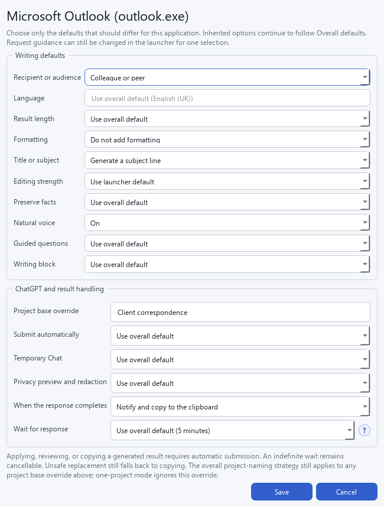
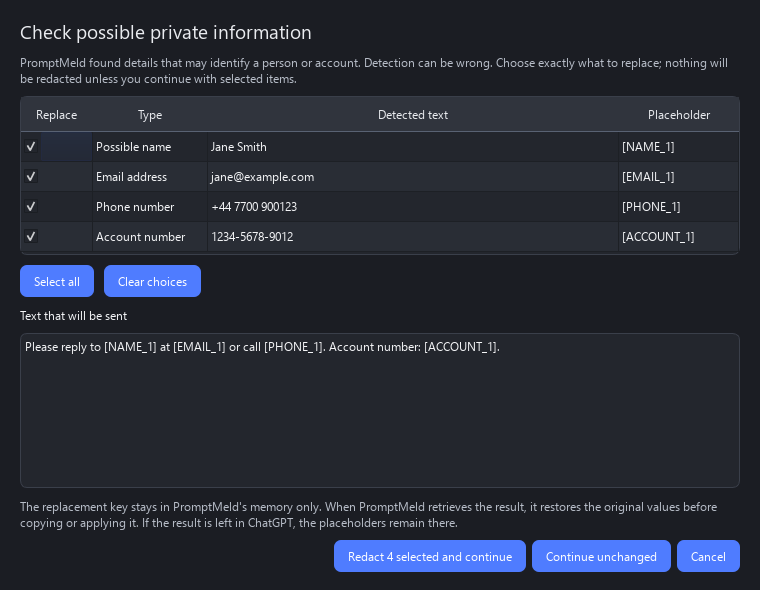

# PromptMeld user guide

This guide explains everyday use of PromptMeld. For individual settings and
editable JSON files, see [Configuration and customisation](CONFIGURATION.md).

## Requirements and compatibility

PromptMeld requires Windows 10 or 11 and the current ChatGPT desktop app for
Windows, signed in to your account. It currently supports the new desktop
experience, not:

- The Classic ChatGPT desktop experience.
- ChatGPT in a web browser.

No OpenAI API key is required. A free ChatGPT account can be used, but models,
reasoning controls, Projects, writing blocks, and related features depend on
your account and plan.

## Basic workflow

The first launch opens a short setup guide. It explains that ChatGPT in a web
browser and the ChatGPT Windows desktop app are different experiences, and that
PromptMeld requires the installed desktop app. The guide checks for the app's
Windows launch registration and, if it is missing, offers the official OpenAI
download page and a **Check again** button. It also lets you record and test the
global launcher shortcut against Windows and the included action shortcuts,
and optionally enables startup with Windows. The guide can be opened again
from **Configuration > General > Launcher**.

The app check is local: it reads Windows app and protocol registration without
opening ChatGPT, signing in, or transmitting information. If detection fails
on a managed or unusual installation, setup can still be completed after an
explicit warning.

1. Select text in another application.
2. Press `Ctrl+Alt+Space`.
3. Search for or choose a writing action, then select **Send _action name_**.

Double-clicking an action or selecting it and pressing Enter starts the same
process. For a one-off request, enter an instruction at the bottom of the
launcher and select **Use instruction**. The action list receives most of the
launcher by default. Select **Request options and custom instruction** only
when you need remembered choices, output or guidance controls, additional
context, or a one-off instruction; select **Hide request options** to return
that space to the action list.

The shortcut preserves the source application's focus and selection while the
launcher opens. PromptMeld combines the selected text with the action's
instruction, opens ChatGPT, selects or creates the appropriate Project, starts
a fresh chat, and inserts the completed prompt.

Automatic submission is off by default. You can review the prompt and choose a
model or reasoning level in ChatGPT before sending it. If PromptMeld cannot
verify the required ChatGPT controls, it focuses ChatGPT and leaves the complete
prompt on the clipboard for manual pasting.

Double-click the PromptMeld notification-area icon to open Configuration. The
tray menu also shows the configured launcher shortcut, cancellation and recovery
commands when relevant, updates, and application exit.

## Smart action suggestions

After text is captured, the top of the launcher shows up to four **Suggested**
actions. PromptMeld ranks these from four local signals:

- The source application, such as Outlook, Word, a browser, Teams, or Visual
  Studio Code.
- Whether the selection is short, medium, or long.
- Locally recognised text types such as email, question, complaint, technical
  text, rough notes, review, or online argument.
- How often and how recently you used each action.

For example, Outlook favours email and reply actions, browsers favour comment
and review actions, and Visual Studio Code favours technical explanations and
troubleshooting. Long passages favour shortening and editing, while bullet-like
notes favour actions that shape rough notes.

Suggestions never hide or disable actions. Pinned actions remain under
**Direct actions**, folders remain available, and search uses the same context
to order equally relevant matches. Pause over a suggestion to see why it was
ranked there.

This classification runs entirely inside PromptMeld. It retains only the
source executable, word count and length band, and detected type labels for the
open launcher. It does not retain the selected words in the suggestion context,
write them to usage history, or send them to a ranking service.

## Writing actions and guidance

PromptMeld starts with four universal actions: **Edit, revise & improve**,
**Proofread with minimal changes**, **Shorten without losing meaning**, and
**Draft a reply**. All four are pinned to the launcher home screen and have
default shortcuts. This small core keeps first use straightforward; add only
the specialised packs that suit your writing.

**Add** and **Duplicate** open a short wizard for the action's instruction,
location, search terms, icon, behaviour, and optional tested shortcut. Its
final page combines sample text with the action and shows the complete request
PromptMeld would send, without contacting ChatGPT. Actions can then be
reorganised, disabled, or removed in Configuration. Selecting a folder and
choosing **Delete** removes that folder, nested folders, and their actions only
after a confirmation shows how many actions will be affected. A one-off custom
instruction remains available in the launcher.

The Writing actions tab can import and export human-readable JSON action packs.
Export either the selected action or the complete library. Imported actions are
added without replacing the current library; duplicate internal IDs are
adapted and shortcut clashes are cleared. Custom image files are referenced by
the JSON but are not embedded, so use built-in icons or emoji for a pack that
will move between computers.

Twenty-one optional starter packs provide four actions each. **Browse starter
packs…** opens a searchable catalogue grouped by what you want to do with the
selected text:

- **Reply or respond**: Replies to selected text, Social media replies,
  Customer relations, Email and correspondence, and Complaints and resolution.
- **Edit or revise**: Advanced editing, Tone and voice, Social media editing,
  Arguments and evidence, and Reviews and feedback.
- **Draft or create**: Draft from selected text, Reports and updates, Social
  media writing, Meetings and actions, and CVs and applications.
- **Summarise or extract**: Summaries and extraction.
- **Plan or decide**: Decisions and planning.
- **Review or develop**: Fiction authors and Non-fiction authors.
- **Explain or learn**: Technical communication and Study and learning.

Select a pack to read its description and intended use and inspect every
included action before installing it. Each action's complete ChatGPT
instruction is wrapped directly beneath its name. The icon at the right shows
whether it is already in the library, missing, or different from the catalogue
version. Recommended packs receive a star and sort first using only local
application detection; PromptMeld does not send an application list or
selected text anywhere.

The one primary button adds a pack, adds missing actions, or updates catalogue
content according to the pack's current state. **More** contains relevant
restore and removal operations, and the partial-pack state also offers an
explicit update. Updating retains personal folders, shortcuts, enabled state,
launcher pinning, and natural-voice choices. Restore and remove both show a
confirmation, do not affect unrelated actions, and remain provisional until
Configuration is saved.

**Replies to selected text** now concentrates on direct responses, including
**Sarcastic reply** and **Challenge the selected text**. Strengthening an
argument and checking claims belong to **Arguments and evidence**. Packs are
additive and can be combined, edited, or exported like any other actions.

The social packs separate creating, replying, and editing. YouTube actions
favour compact conversational text, Reddit actions allow more context and
reasoning, and Facebook actions use accessible, moderately brief wording for a
mixed audience. **Customer relations** treats the selection as a customer
query, case history, or request and provides reply, clarification, limitation,
and resolution workflows.

The author packs use ChatGPT as a developmental reader rather than a substitute
author. **Fiction authors** includes beta-reader reactions, deeper story
questions, continuity and point-of-view checks, and scene diagnosis.
**Non-fiction authors** includes critical-reader feedback, argument and evidence
testing, reader-journey review, and questions that expose assumptions or areas
for further research. These actions analyse the selected passage and explicitly
avoid rewriting or continuing it unless the user chooses a separate editing
action.

Each action also has a **Purpose** and **Result handling** setting. Edit and
reply actions normally follow the source application's result policy. Actions
whose purpose is analysis, information extraction, or idea development instead
open a review window by default, preserve the original selection, and withhold
**Apply now**. This prevents beta-reader feedback, summaries, questions, and
risk lists from being mistaken for replacement prose. An action can explicitly
override the recommendation in Configuration when its output is genuinely
suitable for another destination.

Each writing action can define a **Default audience**. For example, social
actions default to **Public or online audience**, while customer-relation
replies default to **Customer or client**. An action set to inherit uses the
source application's audience. Choosing an audience under **Change this
request** overrides both for that request only.

The action library supports nested folders, so actions from different packs can
share intent-led roots such as `Reply`, `Edit & revise`,
`Summarise & understand`, and `Review & develop`. Expand a folder in the tree
to browse its children.
Choose **New subfolder** to select a parent and name a nested level, or edit a
folder path directly with `/` between levels.

The launcher's **Remembered output** menu can also request a separate title or
subject line alongside the complete rewritten text. Choose **Generate a
title**, **Generate a subject line**, or **Choose title or subject
automatically**. PromptMeld asks ChatGPT to put the labelled suggestion first,
followed by the complete main text, so a review title or email subject can be
copied into its separate field. **Do not add one** preserves the previous
single-result behaviour and remains the default.

Use **This request: intent or additional context** to add a desired outcome,
constraint, or point that is not already present in the source. PromptMeld
keeps this guidance separate from the selected text.

The **Change this request** menu provides per-request controls for:

- **Editing strength:** Default, Proofread, Improve, or Rewrite.
- **Preserve facts and specifics:** protects names, dates, amounts, quotations,
  URLs, product details, policies, and commitments.
- **Recipient or audience:** adapts wording for personal, workplace, customer,
  support, public, or general-reader contexts.
- **Number of alternatives:** requests one result, two alternatives, or three
  alternatives.

These choices reset for each newly captured selection. The selected action's
audience default applies first, then the source application's audience when the
action inherits it; an audience chosen in the launcher takes priority over
both.

## Application profiles

The **Applications** tab can give each Windows executable its own writing and
delivery defaults. Double-click an application row to configure:

- Audience and primary language.
- Result length, formatting, optional title or subject generation, editing
  strength, and factual preservation.
- Natural voice, guided questions, and writing blocks.
- ChatGPT Project base name, automatic submission, Temporary Chat, and privacy
  preview and redaction.
- How long PromptMeld waits for a completed response, including an indefinite
  but cancellable wait.
- Whether the generated result is left in ChatGPT, applied automatically,
  copied with a notification, or held for review with **Copy result** and
  **Apply now** actions.

Every setting can inherit the overall default, so a profile only needs to
specify what is different for that application.

Under **Configuration > General > ChatGPT Projects**, choose how normal chats
are organised:

- **Writing action or folder** retains the current behaviour, producing names
  such as `PromptMeld - Editing`.
- **One project for everything** always uses `PromptMeld`.
- **Application the text came from** produces names such as
  `PromptMeld - Microsoft Outlook` or `PromptMeld - Google Chrome`.

The project base name can be changed from `PromptMeld`. An application profile
can supply a different base for that application, after which the same naming
strategy is applied. **One project for everything** deliberately ignores those
application overrides so every normal request uses the same project. Temporary
Chat continues to bypass Projects entirely.

The hierarchy is deliberate: **Overall defaults** are remembered, an
application profile overrides them for one executable, and controls labelled
**This request** reset when a new selection is captured.

New configurations include useful examples:

- Word waits until completion or cancellation, then replaces a verified
  editable selection.
- Notepad replaces the selection and requests plain text.
- Outlook and New Outlook copy plain-text results for manual placement.
- Chrome, Edge, and Firefox wait up to ten minutes, notify, and copy the result
  rather than assuming the original browser content is editable.
- Teams and Slack copy short, plain-text wording aimed at a colleague or peer.

All starter profiles can be edited or removed.

## Privacy preview and redaction

Before opening the request in ChatGPT, PromptMeld checks the completed prompt
locally for likely email addresses, phone numbers, account numbers, and names.
Names are recognised from titles, greetings, labelled fields, signatures, and
capitalised full names in the selected source or additional-context blocks.
Detection is deliberately presented as a suggestion: it can miss details or
mark ordinary text, so every match must be reviewed.

**Show a privacy preview and offer reversible redaction before sending** is on
by default under **Configuration > Overall defaults > Submission**. Clear it
to skip this check entirely and send the prompt unchanged. An application
profile can inherit that choice or force the preview on or off for one source
application.

When possible private information is found, **Privacy preview** shows its type,
detected value, proposed placeholder, and the exact redacted text that would be
sent. Every row can be selected independently. Choose **Redact selected and
continue**, **Continue unchanged**, or **Cancel**. PromptMeld never redacts a
request without displaying this window and receiving an explicit choice.

Placeholders use forms such as `[EMAIL_1]`, `[PHONE_1]`, `[ACCOUNT_1]`, and
`[NAME_1]`. The replacement key remains only in memory and is passed to the
local automation helper. When PromptMeld retrieves ChatGPT's completed result,
it restores exact placeholders before copying, reviewing, or applying the
text. If result handling is configured to leave the response in ChatGPT—or the
prompt is left for manual submission—the placeholders remain in ChatGPT and
must be interpreted there. Altered or omitted placeholders cannot be restored
automatically.

## Generated results, replacement, and recovery

After automatic submission, PromptMeld can notify, copy generated text, or
replace the original selection. The inherited response wait is five minutes,
and each application profile can choose one, three, five, ten, or twenty
minutes, or wait indefinitely until you cancel. You can continue working in
another window during that time; monitoring and copying a finished response
use background-safe accessibility controls and do not take focus merely to
check progress.

Before replacement, PromptMeld returns to the source window and verifies that
the same text remains selected in an editable control. If you are actively
working in a different window when the response arrives, PromptMeld avoids
interrupting you and copies the result instead. If the selection or document
changed, it likewise will not paste over the changed content.

If focus, selection, editability, or paste access changed, PromptMeld leaves the
original alone and copies the generated result instead. The original text is
preserved in memory and the tray offers **Undo last replacement** and
**Copy preserved original**. Preserved text is never written to disk and is
forgotten when PromptMeld closes or a newer original replaces it.

When a generated response is available, the completion window provides
**Copy result** and, for an editable captured source, **Apply now**. The same
commands remain available in the tray as **Copy latest result** and
**Apply latest result now** after the completion window is closed. Applying
later returns to the original application and verifies that the same text is
still selected before replacing it. If verification fails, PromptMeld leaves
the source untouched and copies the result instead.

For an action using the safe analysis, extraction, or development default, the
review window explains why the original was preserved. **Copy result** remains
available, but **Apply now** is also withheld from the tray so the supporting
material cannot accidentally overwrite the selected passage.

For a rewrite held for review, PromptMeld shows **Before** and **After - selected
changes** side by side. Proposed changes appear in a checklist; clear an item to
retain that exact part of the original, or use **Accept all changes** and
**Reject all changes** for a quick decision. The selected result is rebuilt
losslessly from the source and rewrite, so **Copy selected rewrite** and
**Apply selected changes** use only the accepted changes. Applying still
verifies that the original source selection has not changed.

The separate **Editorial feedback** view contains an overview and any comments
ChatGPT linked to exact source passages. Selecting a linked comment highlights
its passage in **Before** when an exact match is available. PromptMeld requests
this structured response only for retrieved review results. If ChatGPT does not
follow the structure, the complete response remains available as a rewrite or
feedback result and the local before-and-after comparison still works.

Only the latest generated result is retained, in memory, for these commands.
It is forgotten when PromptMeld closes and is not included in settings, logs,
diagnostics, or backups.

When **Two alternatives** or **Three alternatives** is selected under
**Change this request**, PromptMeld asks ChatGPT for distinct complete options
and opens a review window after generation. Choose an option on the left to
read it, accept or reject its changes, then use **Copy selected rewrite** or
**Apply selected changes**. The selectively reconstructed option also becomes
the latest result available from the tray.

Alternative review requires automatic submission so PromptMeld can retrieve
the response. If automatic submission is normally off, PromptMeld asks for
permission to enable it for that request only; the remembered setting is not
changed. Automatic copying and replacement are paused until an alternative is
chosen. If ChatGPT does not follow the requested separators, PromptMeld shows
the complete response as one option rather than guessing where to split it.

The automation progress window can be cancelled with its button or Escape.
Actionable failures remain visible, while Configuration can copy
privacy-filtered diagnostics or open the local log folder. For the detailed
automation sequence, see [ChatGPT automation and fallback behaviour](AUTOMATION.md).

## Backup and restore

Use **Configuration > Backup & recovery** to save actions, settings,
application profiles, hotkeys, and installed custom icons in one portable ZIP
file. The backup excludes usage history, logs, update state, selected text,
prompts, and responses. Its suggested filename includes the PromptMeld version
and creation time, while the internal manifest records the app version, backup
format version, and timestamp for validated future restoration.

Before restoring a validated backup, PromptMeld automatically saves the current
configuration as a separate safety backup. The restored configuration is then
reloaded immediately. The same tab contains privacy-filtered diagnostics and
log-folder access.

Use **Reset configuration** in the same tab to return actions, application
profiles, shortcuts, writing defaults, and custom icons to their original
defaults. After confirmation, PromptMeld creates a pre-reset safety backup,
keeps usage history and logs, and closes. Open it again to run through the
first-use setup guide with the default launcher shortcut and startup choice.

## Temporary Chat

Turn on **Temporary Chat** in the launcher or an application profile when you
do not want an action to use its configured Project. On first use, ChatGPT may
show an explanation with a **Continue** button. PromptMeld pauses so you can
read and respond to that dialog yourself; it never accepts it for you.

## Default shortcuts

| Shortcut | Action |
|---|---|
| `Ctrl+Alt+Space` | Capture selected text and open the launcher |
| `Ctrl+Alt+1` | Edit, revise & improve |
| `Ctrl+Alt+2` | Proofread with minimal changes |
| `Ctrl+Alt+3` | Shorten without losing meaning |
| `Ctrl+Alt+4` | Draft a reply |

Shortcuts can be changed in **Configuration > Hotkeys**. PromptMeld identifies
duplicates and asks Windows whether a shortcut is already registered by another
application.

## Accessibility

PromptMeld supports keyboard navigation throughout the launcher,
Configuration, setup guide, progress window, and generated-result review.
Automation stage changes are exposed as quiet screen-reader status updates,
including the current operation, completion, cancellation, and failures. The
accessible stage history identifies which operations are current or completed.

Confirmation, information, warning, and error dialogs use explicit high-
contrast text, background, detail-text, button, hover, and keyboard-focus
colours in both PromptMeld light and dark modes. Windows High Contrast replaces
these fixed colours with the active system palette.

When **Show animations in Windows** is turned off, PromptMeld positions the
active progress stage immediately instead of smoothly scrolling it into view.
Windows High Contrast overrides PromptMeld's selected light or dark theme: the
main windows use the active Windows colours, selection colours, borders, and
focus indicators. These behaviours are automatic and require no separate
PromptMeld setting.

## Updates

Installed copies check the latest stable GitHub release at most once per day.
When a newer version is available, PromptMeld shows one Windows notification
and keeps an **Update available** entry in its tray menu. You can also choose
**Check now** in **Configuration > General > Updates**.

PromptMeld validates the expected installer name, advertised size, secure
download location, and GitHub-provided SHA-256 digest. It then opens the normal
visible installer, which performs the update and can relaunch PromptMeld.
Automatic checks can be disabled; manual checks remain available.
